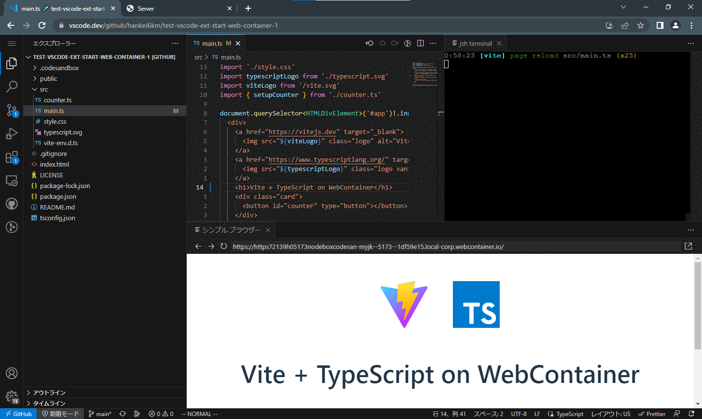

# Start WebContainer

Start [WebContainer](https://webcontainers.io/), and use Jsh and Preview URL.

This extension dynamically generates an external tab with Cross Origin isolation enabled using [Nodebox](https://sandpack.codesandbox.io/docs/advanced-usage/nodebox)(the `Server` tab in the figure below). Therefore, the [`?vscode-coi=on`](https://github.com/microsoft/vscode/issues/137884) parameter is not required in VS Code for the Web.

## Features

- Start WebContainer from VS Code for the Web
- Open a terminal with Jsh
- Open Preview URL with Simple Browser
- Automatically reflect changes to WebContainer when there are any changes to the Workspace file
- Import WebContainer files to Workspace

Background file sync is not supported.
Does not supported to multi-root workspace.
Containers are not persistent.

## Usage

### Start WebContainer(Open terminal with Jsh)

1. Open the Workspace(Local folder or Remote repository)
2. Execute the `Start WebContainer: Start` command from the command palette
3. The URL(`https://*.nodebox.codesandbox.io/`) for starting WebContainer will open in an external tab
4. Workspace files will be loaded to WebContainer

When you edit files in the editor, they will be automatically reflected in WebContainer. However, it will not be reflected in the following cases.

- Changes outside the editor
- Create and delete files

> 📘 `npm install`:
>
> - `npm install` is not executed automatically. Please execute it manually
> - Even if `package.json` and` package-lock.json` are updated, they will not be automatically reflected in the Workspace(See `Start WebContainer: Pick up all files from a container` below)

### Open Preview URL

1. Execute the `Start WebContainer: Preview` command from the command palette
2. Select from the list of available Prview URLs
3. The Preview URL will open in the Simple Browser

### Pick up all files from a WebContainer

1. Execute the `Start WebContainer: Pick up all files from a container` command from the command palette
2. The files in the WebContainer will be overwritten to the Workspace
